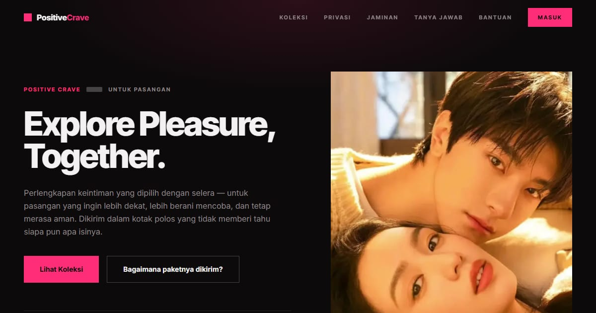

# Positive Crave — Konsep Noir

Landing page Positive Crave konsep "Noir": intimacy essentials untuk pasangan — berani, playful, dan percaya diri.

**Demo live:** https://crave-noir.vercel.app



> Konsep desain untuk kontes brief Positive Crave, bukan toko resmi. Checkout dan login hanya purwarupa.

## Konsep

Konsep "Noir" dengan bahasa rupa **Tanpa Label**, karena nilai jual utama brief ini adalah kerahasiaan: bidang hitam pekat, blok sensor, warna kraft kotak polos, dan satu aksen merah muda neon yang dipakai sehemat mungkin.

## Halaman

`/` · `/checkout` · `/forgot` · `/masuk` · `/produk` · `/register`

## Teknologi

- Next.js 15.5 (App Router) dan React 19
- Tailwind CSS v4
- JavaScript
- Framer Motion, Lucide (ikon)
- Font: Inter Tight, Inter (next/font)
- SEO: metadata per halaman, Open Graph, JSON-LD, sitemap.xml, dan robots.txt

## Menjalankan secara lokal

```bash
npm install
npm run dev
```

Buka http://localhost:3000. Untuk build produksi: `npm run build` lalu `npm start`.

## Kredit foto

Foto hero berlisensi **CC0 (domain publik)**: bebas dipakai, termasuk untuk komersial, tanpa wajib atribusi. Asalnya tetap dicatat di sini supaya jelas.

- `public/images/hero.webp` — "Couple Love" oleh Morgan Sessions, StockSnap, CC0 ([sumber](https://stocksnap.io/photo/couple-love-AAM8X0DRXY)). Dipotong ke 4:5.
- `public/images/kategori-berdua.webp` — "Free couple holding hand image", rawpixel, CC0 ([sumber](https://www.rawpixel.com/image/5927571/photo-image-public-domain-hands-women)). Dipotong ke 4:5.
- `public/images/minyak-pijat.webp` — ilustrasi buatan sendiri untuk purwarupa ini.
- Foto produk lainnya (`p2`–`p8`, `p14`) belum terverifikasi asal-usulnya. Ganti dengan foto produk asli klien sebelum situs dipakai sungguhan.

---

Bagian dari koleksi 9 entri kontes desain web di [PortalKontes](https://www.pintuweb.com/kontes-desain). Dibuat oleh [PintuWeb](https://www.pintuweb.com), jasa pembuatan website.
